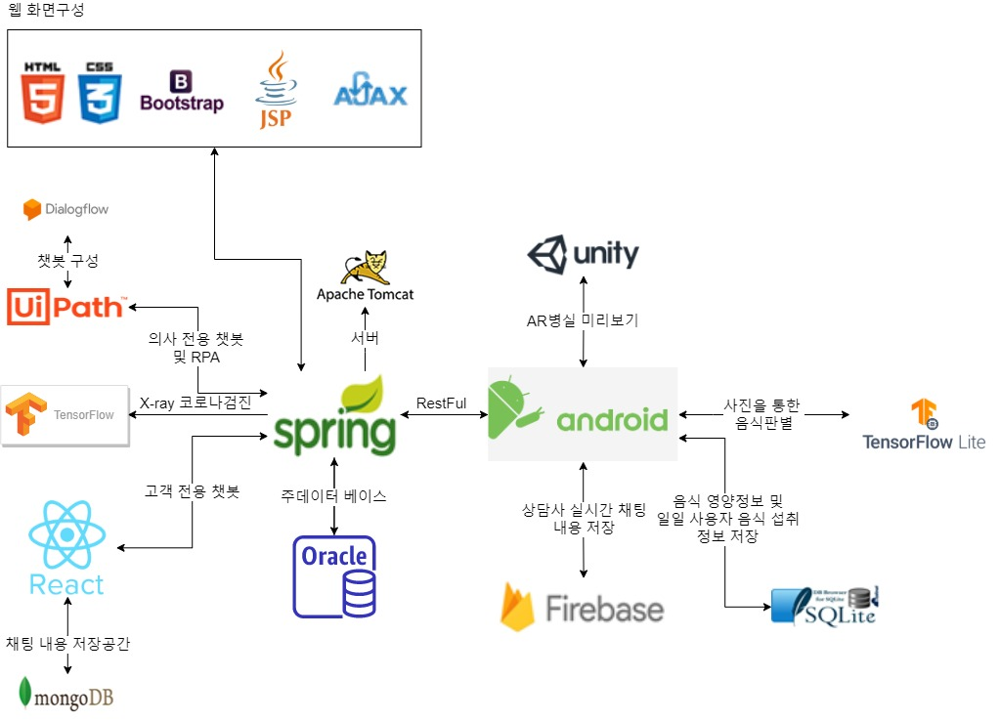

# 프로젝트 개요

- 프로젝트명 : Lifecare(신기술을 접목시킨 병원 시스템 구축)
- 팀원 : 한승운, 이한림, 진은성, 윤재진, 이건희, 차세웅, 김수정
- 프로젝트 기간 :  2020.09.07 ~ 2020.10.15 ( 5주 )

# 프로젝트 구성

# 빌드 버전

- JAVA
  - jre-8u241-windows-x64
  - jdk-8u241-windows-x64
- Oracle
  - 

