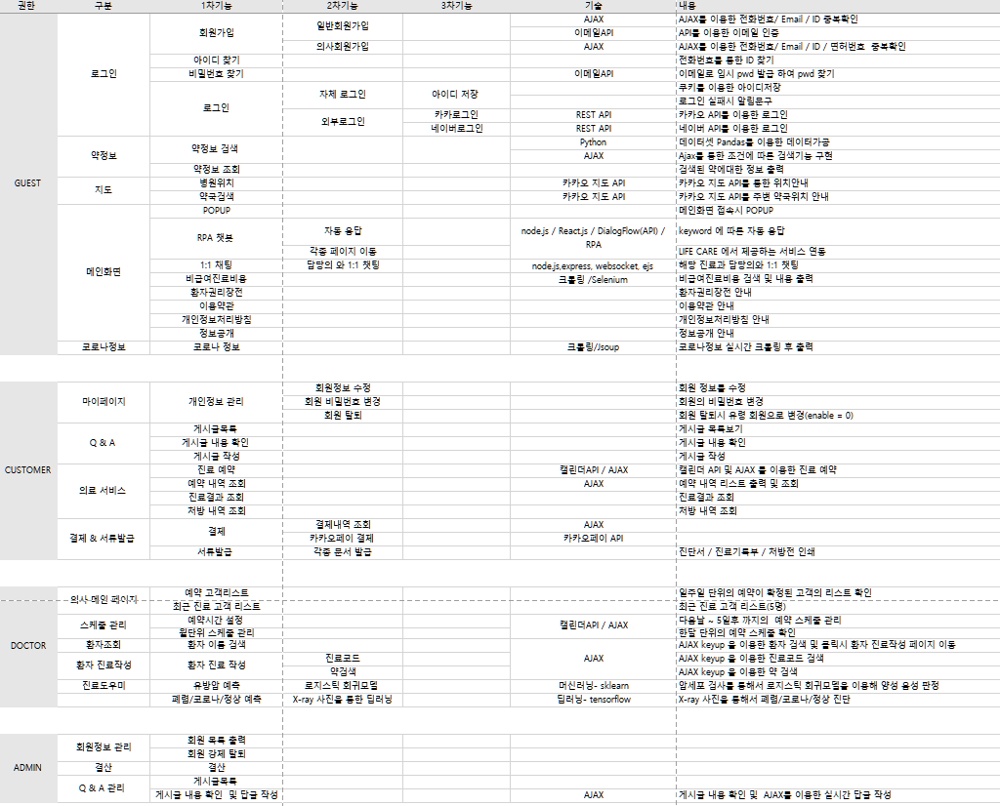
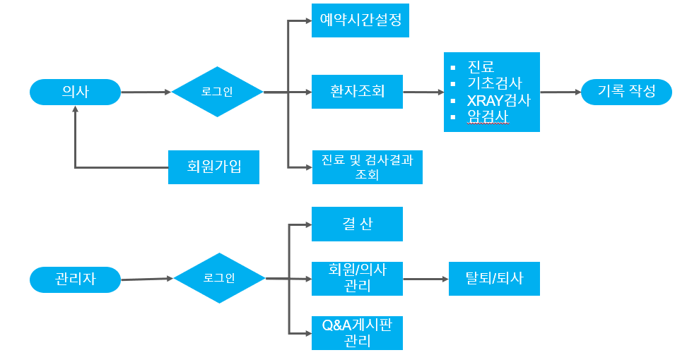
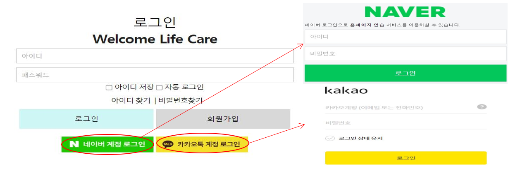
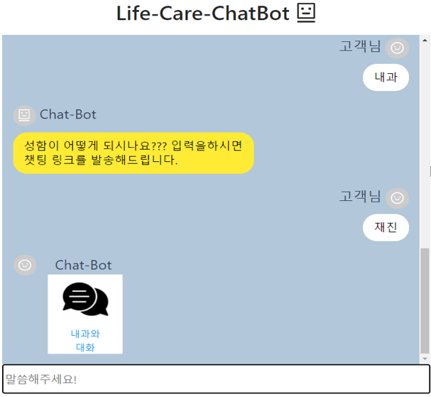
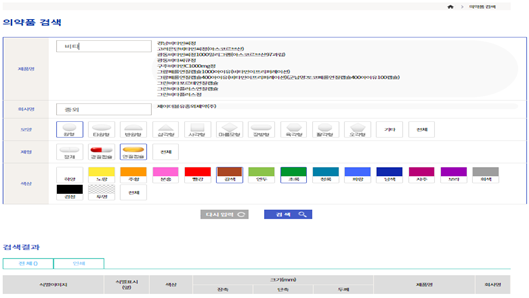
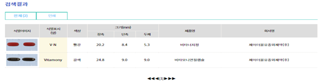
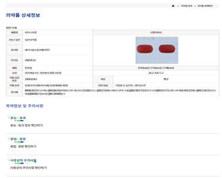

### 🏠 [Github/spring](https://github.com/swhan9404/spring_lifecare)  :iphone: [Github/Android](https://github.com/swhan9404/android_lifecare)  :page_with_curl:[기능정의서](https://drive.google.com/file/d/1LZsXce04RQRZWH4noepl6sUtd362d0IS/view?usp=sharing) :microphone:[Presentation](https://youtu.be/8FPHJWBBEOk)

# :star: 프로젝트 개요

- 프로젝트명 : Lifecare(신기술을 접목시킨 병원 시스템 구축)
  - spring : 의사 사용자 중심의 진료시스템
  - android : 환자 중심의 편의시스템
- 팀원 : 한승운, 이한림, 진은성, 윤재진, 이건희, 차세웅, 김수정
- 프로젝트 기간 :  2020.09.07 ~ 2020.10.21 ( 6주 )

# :wrench: 프로젝트 구성

# :green_book: spring 프로젝트 기능

## :hospital:업무 흐름도(의사, 관리자)

## :mask:업무흐름도(고객)

# :mag: overview

## 1.  메인페이지 - 실시간 코로나 정보 표출

## 2. 소셜 로그인

## 3. 환자 문의용 챗봇

## 4. 약정보 조회

## 5.  의사 예약관리

## 6. 유방암 검사

## 7. X-ray를 통한 코로나/폐렴 검진

## 8. 결산페이지

